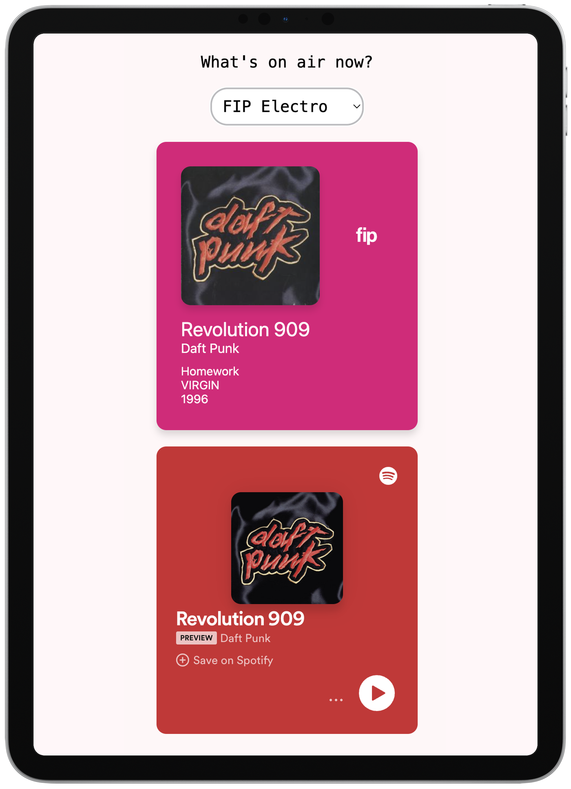

# Spotifip - FIP Radio Companion

Spotifip is a fun and simple website for keeping up with what's playing on my favorite French radio station, FIP. It's a laid-back place where you can catch the vibe of FIP's playlist and even listen to a sneak peek of the tracks using Spotify. Plus, if you hear something you really dig, you can add it to your liked songs on Spotify with just a click.

[Live demo](https://spotifip.vercel.app/)

<p align="center">
    
</p>

## What's in the Mix

Spotifip isn't loaded with features, but it's got the essentials:

- **What's on air?**: Keeping you updated in real-time with the tracks FIP is spinning.

- **Spotify Grooves**: Hear a snippet of a song on Spotify and decide if it's your jam. If it is, save it to your Spotify liked songs with just one click.

## The Behind-the-Scenes Jam

Let's break down how Spotifip works:

### Backstage

- **Go**: A trusty Go microservice is the engine running the show. It hangs out on my personal VPS and does all the behind-the-scenes work.

- **Supabase**: I stash away the tunes details in an amazing Supabase project. It's like my secret stash of musical treasures.

- **Spotify API**: To find the tunes and get those Spotify links, we tap into the magical Spotify API.

### What You See

Our frontend is all about keeping it simple:

- **Vanilla JS**: It's the plain and simple JavaScript flavor that powers our frontend, ensuring quick loading and smooth interaction.

- **Supabase Connection**: We've hooked up with the Supabase JS client to fetch the data and bring it to your screen.

## How to Get the Groove

Ready to vibe with FIP on Spotifip? It's a breeze! Just drop by the website, and you'll find the current delight right there. You can click on tracks to hear a snippet and decide if you want to add them to your Spotify liked songs. No fuss, no frills—just music discovery, the easy way.

Spotifip is all about enhancing your FIP experience. No bells and whistles, just good music and an easy way to make it yours. Give it a spin and let us know what you think!

## Wanna run your own?

### Instructions

- Install [Go](https://golang.org/doc/install)
- Create your app and get your credentials on [Spotify for developers](https://developer.spotify.com/dashboard)
- Create your project on [Supabase](https://supabase.com)
- Add your own environment variables in the `.env-example` file and rename it to `.env`:

```dotenv
FIP_API_BASE_URL=https://www.radiofrance.fr/fip/api/live/webradios/

SPOTIFY_CLIENT_ID=[xxx]
SPOTIFY_CLIENT_SECRET=[xxx]

SUPABASE_POSTGRES_ADDR="db.[xxx].supabase.co:5432"
SUPABASE_POSTGRES_USER="postgres"
SUPABASE_POSTGRES_DB="postgres"
SUPABASE_POSTGRES_PASSWORD=[xxx]
```

- Add your Supabase public variables in the first two lines of `frontend/script.js`:
```javascript
const SupabaseUrl = "https://[xxx].supabase.co"
const SupabasePublicAnonKey = "[xxx]"
```

Easily compile and run locally the backend with [Task](https://taskfile.dev/#/installation):

```bash
cd backend && task
./spotifip-local
```

A GitHub Action is configured to push the compiled linux amd64 binary `spotifip` to my remote VPS at every push.

The frontend doesn't need any build step, just open `frontend/index.html` in your browser.

## License

This project is licensed under the MIT License - see the [LICENSE.md](LICENSE.md) file for details.

## Credits

- Fip logo by [Radio France](https://www.radiofrance.fr/fip).

---

Enjoy using Spotifip! If you have any questions or feedback, please don't hesitate to [contact me](mailto:antoine.gelloz@gmail.com).
